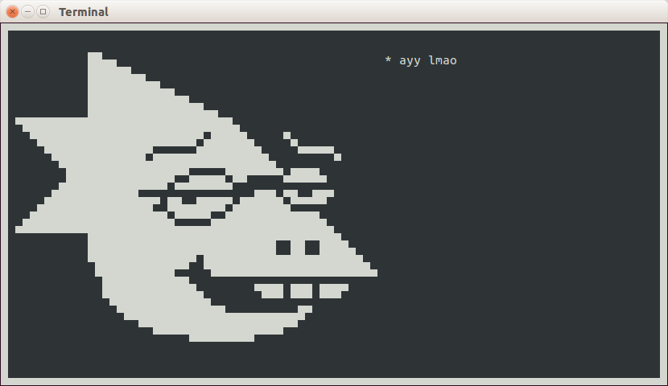

# Underlogue

Overview
------
Underlogue uses the ncurses library to produce Undertale-style dialogue boxes in the bash terminal. Features (will) include animated character portraits, creation of dialogue in a bespoke language with a movie script-like syntax, and the ability to let the player choose between two options at any point for different branches of dialogue.

Here's an example of a "script":
~~~~
Alphys (anxious6): "H-hey! I'm uh... not interrupting, am I?" (Yes/No)
Yes:
(
    Alphys (anxious3): "Oh...! Sorry!"
    Alphys (anxious5): "I guess I'll get out of your hair then..."
)
No:
(
    Alphys (surprised): "Oh! Well... good!"
    Alphys: "Anyway, I was just here to remind you to take a break."
    Alphys: "You know, get up and stretch a bit."
    Alphys (anxious3): "I mean, you wouldn't want to end up with posture like mine, r-right?"
    Alphys (anxious1): "H-hahahaha...!!"
    Alphys (anxious7): "Yeah... I'm gonna go now."
)
~~~~

Library Dependencies
-------
* Ncursesw (displaying elements)
* Rapidjson (accessing character-specific data stored in JSON)
* SDL (sound - to be added)
* Flex & Bison ("movie script" language)

Todo (in order of importance)
------
1. Fix various bugs with the ncurses display
1. Add the rest of the characters to the JSON file
3. Better layout of ncurses windows
2. Handle terminal window resizing
5. Allow spaces in expression names
4. Prevent words being cut off on new lines
6. Character voice sounds
7. Reimplement entire project in Python in future?
